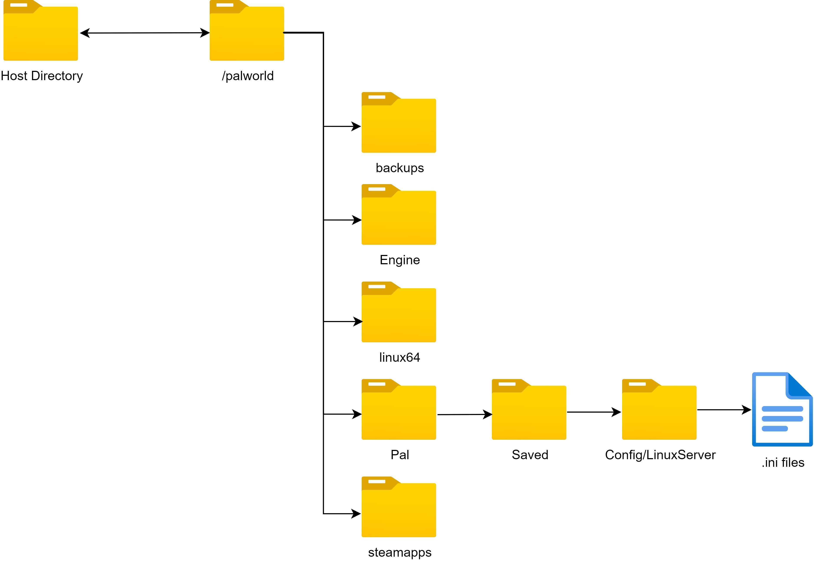

# Palworld Directory

Everything related to the Palworld data is inside the `/palworld` folder inside the container

## Folder structure



| Folder                       | Use                                                               |
|------------------------------|-------------------------------------------------------------------|
| palworld                     | Root folder with all the Palworld Server files                    |
| backups                      | Folder where all the backups from the `backup` command are stored |
| Pal/Saved/Config/LinuxServer | Folder with all the .ini configuration files for manual config    |
| Mods/NativeMods              | Source folder for UE4SS mods (synced when `ENABLE_UE4SS=true`)    |
| Mods/Paks                    | Source folder for `.pak` mods (synced when `ENABLE_UE4SS=true`)   |
| Pal/Binaries/Linux/Mods      | Runtime UE4SS Mods directory                                      |
| Pal/Content/Paks/~Mods       | Runtime pak mods directory                                        |

## Attaching data directory to host filesystem

The simplest way of attaching the palworld folder to your host system is
to use the example given in the compose.yaml file:

```yml
      volumes:
         - ./palworld:/palworld/
```

This creates a `palworld` folder in the current working directory and mounts the `/palworld` folder.
