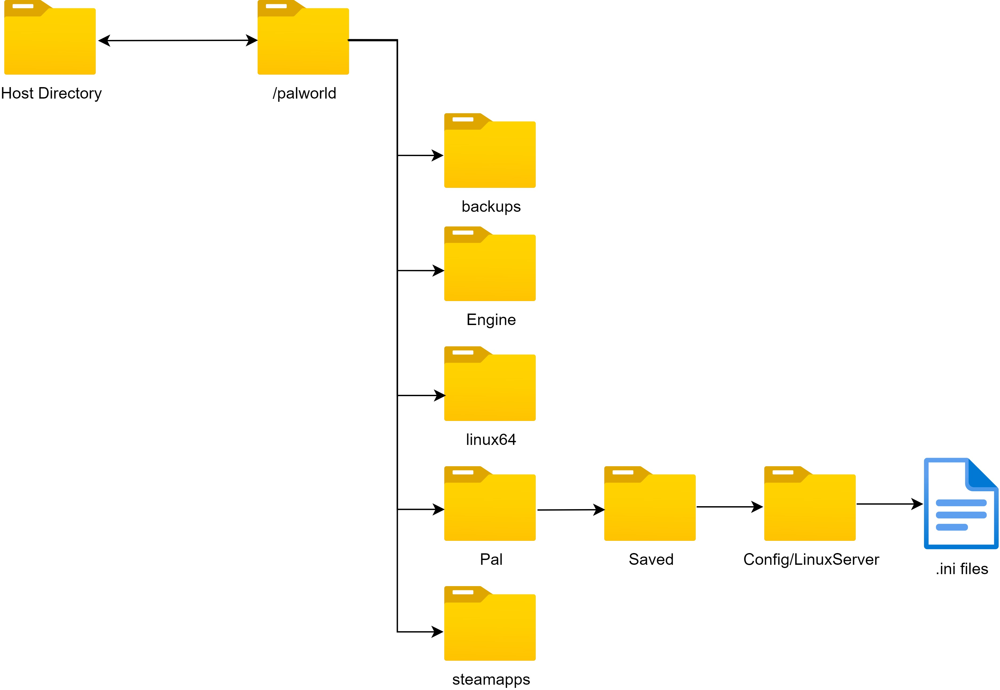

# Palworld 目录

所有与 Palworld 数据相关的内容都在容器内的 `/palworld` 文件夹中。

## 文件夹结构



| 文件夹                       | 用途                                                               |
|------------------------------|-------------------------------------------------------------------|
| palworld                     | 包含所有 Palworld 服务器文件的根文件夹                            |
| backups                      | 存储所有 `backup` 命令生成的备份的文件夹                        |
| Pal/Saved/Config/LinuxServer | 包含所有 .ini 配置文件的文件夹，用于手动配置                      |

## 将数据目录附加到主机文件系统

将 palworld 文件夹附加到主机系统的最简单方法是使用 docker-compose.yml 文件中给出的示例：

```yml
      volumes:
         - ./palworld:/palworld/
```

这将在当前工作目录中创建一个 palworld 文件夹并挂载 /palworld 文件夹。
